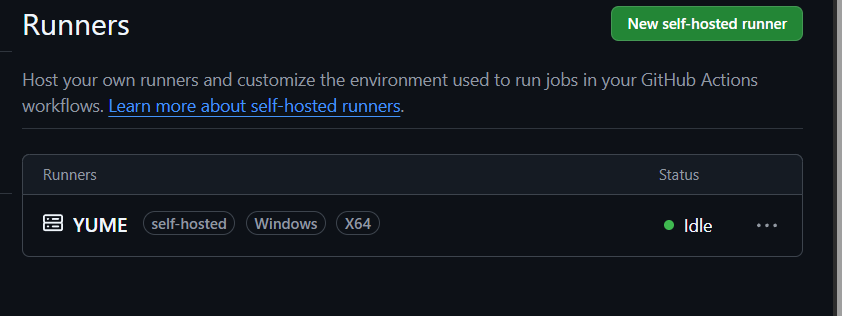
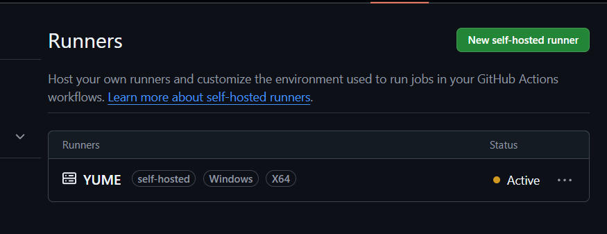
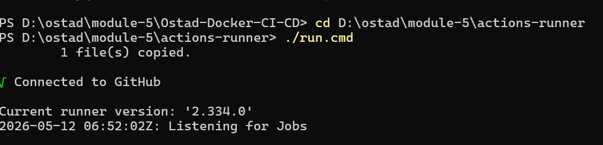
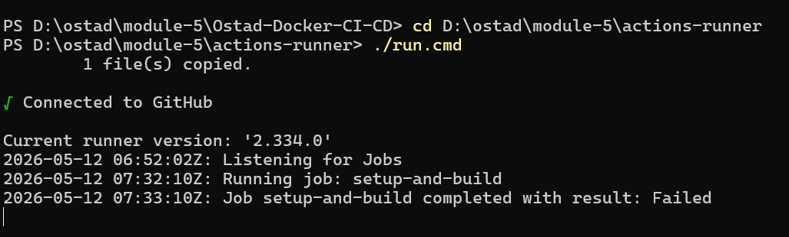
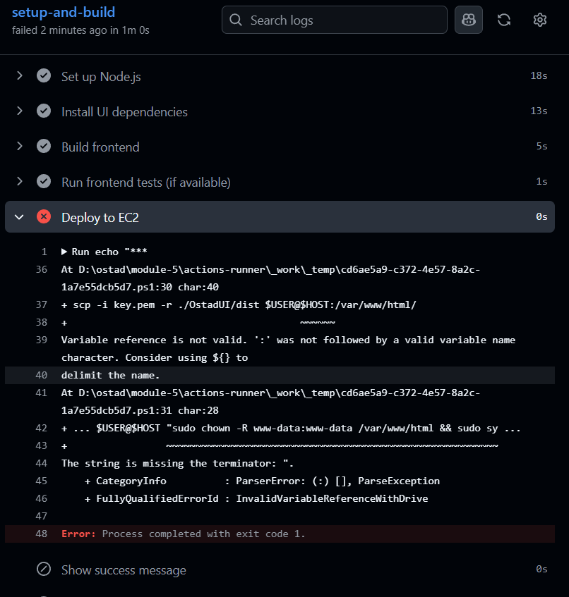
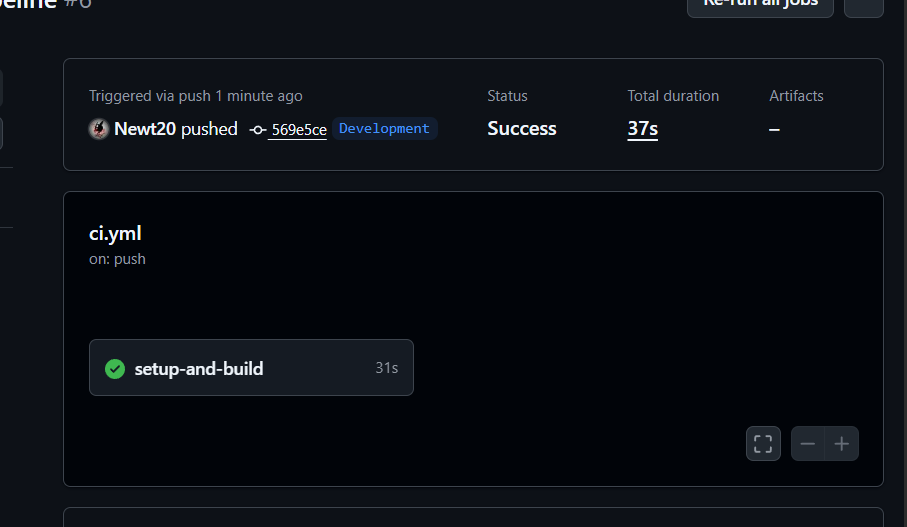
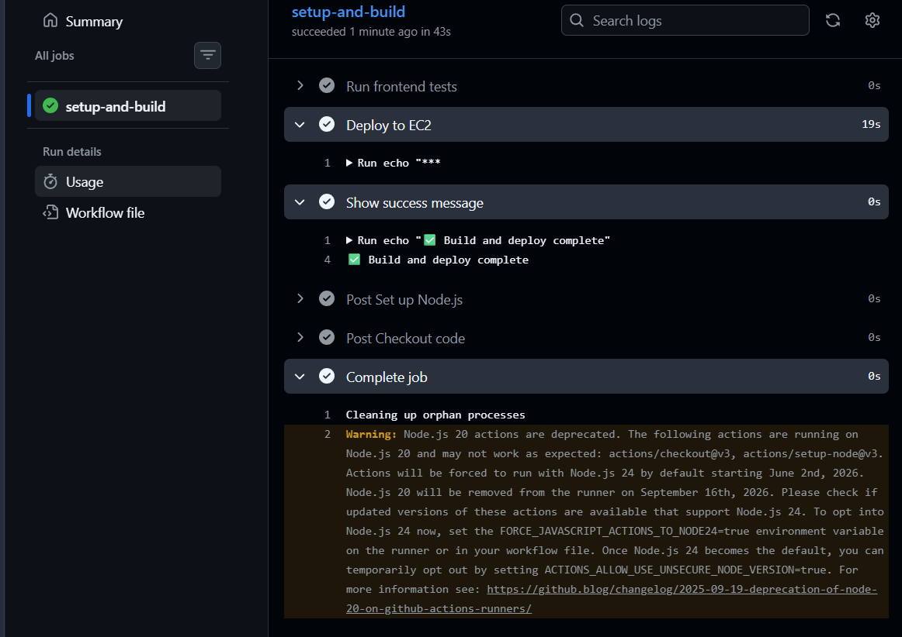
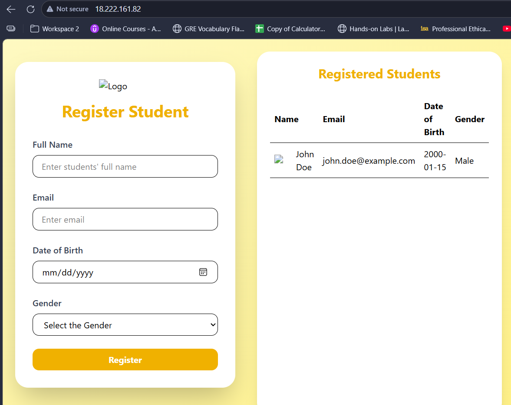

# 🚀 Ostad Docker CI/CD Deployment


## 🔧 Configuration Steps

### EC2 Nginx config file
- Root directory: `/var/www/html/dist`
- Ostad config:
  ```bash
  server {
      listen 80;
      server_name _;
      root /var/www/html/dist;
      index index.html;

      location / {
          try_files $uri $uri =404;
      }
      location ~* \.(?:ico|css|js|gif|jpe?g|png|woff2?|eot|ttf|svg)$ {
        expires 6M;
        access_log off;
        add_header Cache-Control "public";
    }
  }
  ```

## 🔄 CI/CD Pipelines

### Windows Runner without Deployment

```bash

name: Build, Test, and Deploy (Windows Runner)

on:
  push:
    branches: [ Development ]

jobs:
  setup-and-build:
    runs-on: self-hosted 

    steps:
      - name: Checkout code
        uses: actions/checkout@v3

      - name: Set up Node.js
        uses: actions/setup-node@v3
        with:
          node-version: '20'

      - name: Install UI dependencies
        working-directory: ./OstadUI
        run: npm install

      - name: Build frontend
        working-directory: ./OstadUI
        run: npm run build

      - name: Show success message
        run: echo "✅ Build and deploy complete"
```

### Ubuntu Runner With Deployment


```bash
name: Build, Test, and Deploy

on:
  push:
    branches: [ Development ]

jobs:
  setup-and-build:
    runs-on: self-hosted

    steps:
      - name: Checkout code
        uses: actions/checkout@v3

      - name: Set up Node.js
        uses: actions/setup-node@v3
        with:
          node-version: '20'

      - name: Install UI dependencies
        working-directory: ./OstadUI
        run: npm install

      - name: Build frontend
        working-directory: ./OstadUI
        run: npm run build

      - name: Run frontend tests
        working-directory: ./OstadUI
        run: echo "No tests"

      - name: Deploy to EC2
        env:
          HOST: ${{ secrets.EC2_HOST }}
          USER: ${{ secrets.EC2_USER }}
        run: |
          echo "${{ secrets.EC2_KEY }}" > key.pem
          chmod 600 key.pem
          scp -i key.pem -r ./OstadUI/dist $USER@$HOST:/var/www/html/
          ssh -i key.pem $USER@$HOST "sudo chown -R www-data:www-data /var/www/html && sudo systemctl restart nginx"

      - name: Show success message
        run: echo "✅ Build and deploy complete"


```

## 📸 Screenshots


--

--

--

--

--

--

--


---

## Walkthrough

Using Windows as the runner, Setup and build was done. But for deployment faced issues with WSL, adding **bash** in the environment variable did not sort out the problem. For that reason, and to make use of easy-to-learn and use linux commands, switched to using Ubuntu as a runner. This made deployment simple and executed easily.

A public EC2 server was used to deploy the front-end application. A self-hosted Runner was configured in Ubuntu(wsl). Secret variables are stored and kept secured in the github settings.

On push to the __Development__ branch the pipeline which otherwise remains idle becomes active and runs as configured. In the end it deploys the front-end in the EC2, which can be seen via the public Ip of the EC2.

---

## Short Notes

### ⚙️ CI/CD (Continuous Integration & Continuous Deployment)

Continuous Integration (CI): Developers frequently merge code changes into a shared repository. Automated builds and tests run to catch errors early, ensuring the codebase stays stable.

Continuous Deployment (CD): Once code passes tests, it’s automatically deployed to production (or staging). This reduces manual steps and speeds up delivery of new features.


### 🖥️ Self‑Hosted Runner

A self‑hosted runner is a machine you manage (Windows, Ubuntu, macOS) that runs GitHub Actions jobs instead of GitHub’s cloud runners.

Benefits:

1. Full control over environment (custom tools, network access).

2. Can access private infrastructure (like EC2 instances).

3. Often faster for builds that need large dependencies.

### 🔄 Workflow Execution Process

A workflow is a YAML file in `.github/workflows/` that defines automation steps.

#### Execution Flow

1. **Trigger**
   - An event (e.g., `push` to `Development` branch) starts the workflow.

2. **Jobs**
   - Each job runs on a runner (self‑hosted or GitHub‑hosted).

3. **Steps**
   - Jobs contain steps such as checkout code, install dependencies, build, and deploy.

4. **Environment**
   - Secrets and environment variables are injected at runtime.

5. **Result**
   - If all steps succeed, the workflow completes.
   - Failures stop execution


